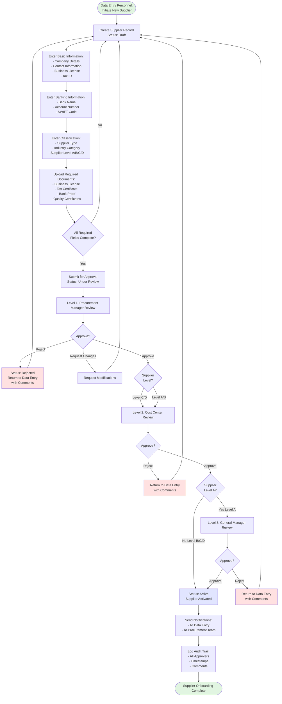
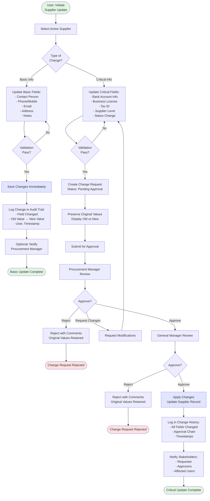
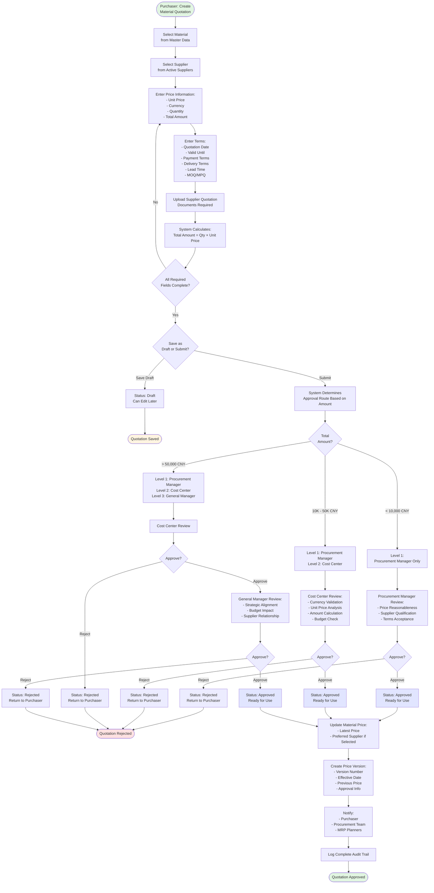

# Process Flow Diagrams: Silverplan Procurement Management System

**Document Version:** 1.0  
**Date:** January 27, 2025  
**Project:** IDURAR ERP-CRM - Silverplan Customization  
**Status:** Documentation

---

## Document Purpose

This document provides visual process flow diagrams for all major workflows in the Silverplan Procurement Management System. Each diagram shows the complete flow including decision points, approval stages, and system actions.

**Diagram Format:** Mermaid flowcharts (renders in GitHub, GitLab, and most modern markdown viewers)

---

## Table of Contents

1. [Supplier Onboarding Workflow](#1-supplier-onboarding-workflow)
2. [Supplier Information Maintenance Workflow](#2-supplier-information-maintenance-workflow)
3. [Material Quotation Approval Workflow](#3-material-quotation-approval-workflow)
4. [Price Strategy Management Workflow](#4-price-strategy-management-workflow)
5. [MRP Generation and Processing Workflow](#5-mrp-generation-and-processing-workflow)
6. [Purchase Order Creation and Approval Workflow](#6-purchase-order-creation-and-approval-workflow)
7. [Pre-payment Application and Approval Workflow](#7-pre-payment-application-and-approval-workflow)
8. [Goods Receipt Workflow](#8-goods-receipt-workflow)

---

## 1. Supplier Onboarding Workflow

### Overview
New suppliers must go through a multi-level approval process before being activated in the system. The approval path depends on the supplier level (A/B/C/D).

### Process Flow



### Approval Matrix

| Supplier Level | Procurement Manager | Cost Center | General Manager |
|----------------|---------------------|-------------|-----------------|
| **Level A** | ✅ Required | ✅ Required | ✅ Required |
| **Level B** | ✅ Required | ✅ Required | ❌ Optional |
| **Level C** | ✅ Required | ✅ Required | ❌ Optional |
| **Level D** | ✅ Required | ✅ Required | ❌ Optional |

### Status Transitions

- **Draft** → **Under Review** (on submit)
- **Under Review** → **Active** (on final approval)
- **Under Review** → **Rejected** (on any rejection)
- **Rejected** → **Draft** (for revision)

---

## 2. Supplier Information Maintenance Workflow

### Overview
Supplier information updates are classified as either **Basic** (immediate update) or **Critical** (requires approval). This ensures data integrity for sensitive information.

### Process Flow



### Field Classification

#### Basic Information (No Approval Required)
- Contact Person
- Phone, Mobile, Fax
- Email
- Website
- Address (Street, City, Province)
- Notes/Remarks

#### Critical Information (Approval Required)
- Bank Account Number
- Bank Name, Branch, SWIFT Code
- Business License Number
- Tax ID
- Supplier Level (A/B/C/D)
- Supplier Status (Active/Inactive/Blacklisted)
- Payment Terms (if contractual)

---

## 3. Material Quotation Approval Workflow

### Overview
Material quotations require approval based on total amount. The system automatically routes to appropriate approval levels based on configured thresholds.

### Process Flow



### Amount-Based Approval Matrix

| Total Amount (CNY) | Procurement Manager | Cost Center | General Manager |
|-------------------|---------------------|-------------|-----------------|
| **< 10,000** | ✅ Required | ❌ | ❌ |
| **10,000 - 50,000** | ✅ Required | ✅ Required | ❌ |
| **> 50,000** | ✅ Required | ✅ Required | ✅ Required |

*Note: Thresholds are configurable per currency*

---

## 4. Price Strategy Management Workflow

### Overview
Implements three-source price comparison strategy where each material maintains prices from three suppliers. One is marked as preferred.

### Process Flow

```mermaid
flowchart TD
    Start([Purchaser: Manage<br/>Material Prices]) --> SelectMaterial[Select Material<br/>for Price Management]
    SelectMaterial --> CheckExisting{Existing<br/>Quotations?}
    
    CheckExisting -->|None| FirstQuote[Create First Quotation]
    FirstQuote --> Quote1Process[Follow Quotation Approval<br/>Workflow]
    Quote1Process --> MarkPreferred1[Mark as Preferred<br/>Supplier 1]
    
    CheckExisting -->|Yes| CountQuotes{How Many<br/>Approved Quotes?}
    
    CountQuotes -->|1 Quote| AddSecond[Add Second Supplier Quote]
    AddSecond --> Quote2Process[Follow Quotation Approval<br/>Workflow]
    Quote2Process --> CompareTwo[System Displays<br/>Two-Source Comparison]
    
    CountQuotes -->|2 Quotes| AddThird[Add Third Supplier Quote]
    AddThird --> Quote3Process[Follow Quotation Approval<br/>Workflow]
    Quote3Process --> ThreeSource[Three-Source<br/>Comparison Complete]
    
    CountQuotes -->|3 Quotes| ThreeSource
    
    ThreeSource --> DisplayComparison[Display Comparison Table:<br/>┌─────────────────────────┐<br/>│ Supplier | Price | Lead Time │<br/>│ Supplier 1 | 100 CNY | 7 days │<br/>│ Supplier 2 | 95 CNY | 10 days │<br/>│ Supplier 3 | 105 CNY | 5 days │<br/>└─────────────────────────┘]
    
    DisplayComparison --> HighlightLowest[Highlight Lowest Price<br/>in Green]
    HighlightLowest --> ShowTerms[Show Complete Terms:<br/>- MOQ/MPQ<br/>- Payment Terms<br/>- Delivery Terms]
    ShowTerms --> SelectPreferred{Change<br/>Preferred<br/>Supplier?}
    
    SelectPreferred -->|No| KeepCurrent[Keep Current Preferred]
    SelectPreferred -->|Yes| RequestChange[Request Preferred<br/>Supplier Change]
    
    RequestChange --> JustifyChange[Provide Justification:<br/>- Price Advantage<br/>- Lead Time<br/>- Quality<br/>- Relationship]
    JustifyChange --> ApprovalNeeded{Requires<br/>Approval?}
    
    ApprovalNeeded -->|Yes High-Value| PM_Approval[Procurement Manager<br/>Approval Required]
    PM_Approval --> PM_Dec{Approve?}
    PM_Dec -->|Reject| KeepCurrent
    PM_Dec -->|Approve| UpdatePreferred
    
    ApprovalNeeded -->|No Low-Value| UpdatePreferred[Update Preferred Supplier:<br/>- Change Rank<br/>- Update Material Master<br/>- Update Default Price]
    
    UpdatePreferred --> CreatePriceVersion[Create Price Change Version:<br/>- Old Preferred → New Preferred<br/>- Old Price → New Price<br/>- Effective Date]
    CreatePriceVersion --> LogPriceChange[Log in Price History:<br/>- All Three Prices<br/>- Comparison Data<br/>- Change Reason<br/>- Approver]
    
    MarkPreferred1 --> NotifyMRP1[Notify MRP System:<br/>Price Update Available]
    LogPriceChange --> NotifyMRP2[Notify MRP System:<br/>Price Update Available]
    KeepCurrent --> NotifyMRP3[Update Last Reviewed Date]
    
    NotifyMRP1 --> End([Price Strategy Updated])
    NotifyMRP2 --> End
    NotifyMRP3 --> End
    
    style Start fill:#e1f5e1
    style End fill:#e1f5e1
    style ThreeSource fill:#e1e5ff
    style UpdatePreferred fill:#e1e5ff
```

### Three-Source Comparison Table Format

```
┌─────────────┬──────────────────────────────────────────────────────┐
│   Field     │ Supplier 1 (Preferred) │ Supplier 2 │ Supplier 3    │
├─────────────┼──────────────────────────────────────────────────────┤
│ Supplier    │ ABC Corp               │ XYZ Ltd     │ 123 Co        │
│ Unit Price  │ 100.00 CNY            │ 95.00 CNY  │ 105.00 CNY    │
│ Currency    │ CNY                    │ CNY         │ CNY           │
│ Lead Time   │ 7 days                 │ 10 days     │ 5 days        │
│ MOQ         │ 100 EA                 │ 200 EA      │ 50 EA         │
│ MPQ         │ 10 EA                  │ 20 EA       │ 10 EA         │
│ Payment     │ Net 30                 │ Net 60      │ Net 30        │
│ Valid Until │ 2025-06-30            │ 2025-05-31  │ 2025-12-31    │
│ Last Update │ 2025-01-15            │ 2025-01-10  │ 2024-12-20    │
└─────────────┴──────────────────────────────────────────────────────┘
```

---

## 5. MRP Generation and Processing Workflow

### Overview
MRP (Material Requirements Planning) automatically calculates net requirements considering inventory, in-transit, safety stock, and demand. Results can be converted to purchase orders.

### Process Flow



```mermaid
flowchart TD
    Start([MRP Planner or System:<br/>Initiate MRP Run]) --> TriggerType{Trigger<br/>Type?}
    
    TriggerType -->|Manual| ManualTrigger[User Initiates MRP<br/>Select Materials/Date Range]
    TriggerType -->|Scheduled| ScheduledTrigger[System Auto-triggers<br/>Per Schedule Daily/Weekly]
    
    ManualTrigger --> ValidateData{System Ready?}
    ScheduledTrigger --> ValidateData
    
    ValidateData -->|No| DataError[Error: Check Data:<br/>- Inventory Data Available?<br/>- PO Data Available?<br/>- Material Master Complete?]
    DataError --> NotifyError[Notify MRP Planner<br/>of Data Issues]
    NotifyError --> ErrorEnd([MRP Run Failed])
    
    ValidateData -->|Yes| CreateRunID[Create MRP Run ID<br/>Timestamp: YYYYMMDD_HHMMSS]
    
    CreateRunID --> LoopMaterials[For Each Active Material]
    
    LoopMaterials --> GetInventory[Get Current Inventory:<br/>On-Hand Quantity by Location]
    GetInventory --> GetInTransit[Get In-Transit Quantity:<br/>Sum from Open POs]
    GetInTransit --> GetSafety[Get Safety Stock Level:<br/>From Material Master]
    GetSafety --> GetDemand[Get Gross Requirement:<br/>From Sales Orders/Forecast]
    
    GetDemand --> Calculate[Calculate Net Requirement:<br/>= Gross Req - On Hand - In Transit + Safety Stock]
    
    Calculate --> CheckResult{Net<br/>Requirement?}
    
    CheckResult -->|<= 0| NoAction[No Action Needed<br/>Skip Material]
    NoAction --> NextMaterial{More<br/>Materials?}
    
    CheckResult -->|> 0| AdjustMOQ[Adjust for MOQ/MPQ:<br/>Suggested Qty = Ceiling Net Req to MOQ/MPQ]
    AdjustMOQ --> CalcDate[Calculate Suggested Order Date:<br/>= Required Date - Lead Time]
    CalcDate --> GetPreferred[Get Preferred Supplier<br/>and Latest Price]
    GetPreferred --> EstimateCost[Estimate Total Cost:<br/>= Suggested Qty × Unit Price]
    
    EstimateCost --> CheckUrgency{Is Urgent?}
    
    CheckUrgency -->|Required Date < Today + Lead Time| MarkUrgent[Flag as Urgent<br/>isUrgent = true]
    CheckUrgency -->|On Hand < 0| MarkNegative[Flag Negative Inventory<br/>hasNegativeInventory = true]
    CheckUrgency -->|On Hand < Safety Stock| MarkBelowSafety[Flag Below Safety<br/>isBelowSafetyStock = true]
    CheckUrgency -->|Normal| NormalFlag[Normal Priority]
    
    MarkUrgent --> SaveMRP[Save MRP Record:<br/>Status: Suggested]
    MarkNegative --> SaveMRP
    MarkBelowSafety --> SaveMRP
    NormalFlag --> SaveMRP
    
    SaveMRP --> NextMaterial
    
    NextMaterial -->|Yes| LoopMaterials
    NextMaterial -->|No| CompleteMRP[MRP Run Complete]
    
    CompleteMRP --> GenerateSummary[Generate Summary Report:<br/>- Total Materials Analyzed<br/>- Materials with Requirements<br/>- Urgent Requirements Count<br/>- Estimated Total Value]
    
    GenerateSummary --> NotifyPlanner[Notify MRP Planner:<br/>MRP Run Complete<br/>with Summary]
    
    NotifyPlanner --> DisplayResults[Display MRP Results:<br/>Sortable/Filterable List]
    
    DisplayResults --> UserReview[MRP Planner Reviews Results]
    UserReview --> UserAction{Planner<br/>Action?}
    
    UserAction -->|Create PO| SelectLines[Select MRP Lines<br/>for PO Creation]
    SelectLines --> GroupBySupplier{Group by<br/>Supplier?}
    
    GroupBySupplier -->|Yes| CreateMultiplePO[Create Multiple POs<br/>One per Supplier]
    GroupBySupplier -->|No| CreateSinglePO[Create Single PO<br/>with Multiple Lines]
    
    CreateMultiplePO --> PODraft[Generate PO Drafts:<br/>- Pre-fill from MRP<br/>- Material, Qty, Supplier<br/>- Price from Quotation<br/>- Required Date]
    CreateSinglePO --> PODraft
    
    PODraft --> LinkMRP[Link MRP to PO:<br/>Update MRP Status: PO Created<br/>Store PO Reference]
    LinkMRP --> FollowPOWorkflow[Follow PO Approval<br/>Workflow]
    
    UserAction -->|Ignore| MarkIgnored[Update MRP Status:<br/>Status: Ignored<br/>Add Reason/Notes]
    MarkIgnored --> IgnoreEnd([MRP Line Ignored])
    
    UserAction -->|Review Later| KeepSuggested[Status: Under Review<br/>Planner Considering]
    KeepSuggested --> ReviewEnd([MRP Pending Review])
    
    FollowPOWorkflow --> POEnd([PO Created from MRP])
    
    style Start fill:#e1f5e1
    style ErrorEnd fill:#ffe1e1
    style POEnd fill:#e1f5e1
    style IgnoreEnd fill:#fff4e1
    style ReviewEnd fill:#fff4e1
    style MarkUrgent fill:#ffe1e1
    style MarkNegative fill:#ffe1e1
    style SaveMRP fill:#e1e5ff
```

### MRP Calculation Formula

```
Net Requirement = Gross Requirement - On Hand Quantity - In Transit Quantity + Safety Stock

Where:
- Gross Requirement: Demand from sales orders, forecasts, or manual entry
- On Hand Quantity: Current physical inventory
- In Transit Quantity: Sum of quantities from approved, not-yet-received POs
- Safety Stock: Minimum buffer stock defined in material master

Suggested Order Quantity = CEILING(Net Requirement / MOQ) × MOQ
  (Adjusted to meet minimum order quantity and package quantity constraints)

Suggested Order Date = Required Date - Lead Time
```

### MRP Priority Flags

| Flag | Condition | Color Code | Action Required |
|------|-----------|------------|-----------------|
| **Urgent** | Required Date < Today + Lead Time | 🔴 Red | Immediate PO creation |
| **Negative Inventory** | On Hand < 0 | 🔴 Red | Emergency procurement |
| **Below Safety Stock** | On Hand < Safety Stock | 🟡 Yellow | Priority procurement |
| **Normal** | All other cases | 🟢 Green | Standard process |

---

## 6. Purchase Order Creation and Approval Workflow

### Overview
Purchase orders can be created manually or from MRP suggestions. Approval is based on total PO amount with multi-level routing.

### Process Flow



```mermaid
flowchart TD
    Start([Purchaser: Create<br/>Purchase Order]) --> CreationType{Creation<br/>Method?}
    
    CreationType -->|Manual| ManualPO[Create PO Manually]
    CreationType -->|From MRP| FromMRP[Create from MRP Suggestions]
    
    FromMRP --> SelectMRP[Select MRP Lines<br/>Single or Multiple]
    SelectMRP --> AutoPopulate[System Auto-populates:<br/>- Material<br/>- Quantity Suggested Qty<br/>- Supplier Preferred<br/>- Price from Latest Quotation<br/>- Required Date]
    AutoPopulate --> POHeader
    
    ManualPO --> POHeader[Enter PO Header:<br/>- Supplier Selection<br/>- PO Date<br/>- Currency<br/>- Payment Terms<br/>- Delivery Terms<br/>- Shipping Address]
    
    POHeader --> AddLines[Add/Edit PO Lines]
    
    AddLines --> LineDetails[For Each Line Enter:<br/>- Material<br/>- Description<br/>- Quantity, UOM<br/>- Unit Price<br/>- Required Delivery Date<br/>- Line Remarks]
    
    LineDetails --> InternalFields[Enter Internal Traceability<br/>Not Shown to Supplier:<br/>- Customer Order Number<br/>- Customer Model<br/>- Internal SO Number<br/>- Internal Model<br/>- Project Code<br/>- Purpose]
    
    InternalFields --> Calculate[System Calculates:<br/>- Line Amount = Qty × Price<br/>- Subtotal = Sum Line Amounts<br/>- Tax Amount if applicable<br/>- Total Amount]
    
    Calculate --> MoreLines{Add More<br/>Lines?}
    MoreLines -->|Yes| LineDetails
    MoreLines -->|No| AttachDocs[Optional: Attach Documents:<br/>- Specifications<br/>- Drawings<br/>- Quotations]
    
    AttachDocs --> ValidatePO{All Required<br/>Fields Complete?}
    ValidatePO -->|No| LineDetails
    ValidatePO -->|Yes| SaveOption{Save Action?}
    
    SaveOption -->|Save Draft| DraftPO[Status: Draft<br/>Can Edit Later]
    DraftPO --> DraftEnd([PO Saved as Draft])
    
    SaveOption -->|Submit| SubmitPO[Submit for Approval]
    SubmitPO --> DetermineRoute[System Determines<br/>Approval Route<br/>Based on Total Amount]
    
    DetermineRoute --> CheckAmount{PO Total<br/>Amount?}
    
    CheckAmount -->|< 20,000 CNY| L1_PM[Level 1:<br/>Procurement Manager Only]
    CheckAmount -->|20K - 100K CNY| L2_PMCC[Level 1: Procurement Manager<br/>Level 2: Cost Center]
    CheckAmount -->|> 100,000 CNY| L3_PMCCGM[Level 1: Procurement Manager<br/>Level 2: Cost Center<br/>Level 3: General Manager]
    
    L1_PM --> PM_Rev[Procurement Manager Reviews:<br/>- Supplier Approval Status<br/>- Price vs Quotation<br/>- Terms Acceptance<br/>- Delivery Schedule]
    PM_Rev --> PM_Dec{Decision?}
    
    L2_PMCC --> PM_Rev2[Procurement Manager Review]
    PM_Rev2 --> PM_Dec2{Approve?}
    PM_Dec2 -->|Approve| CC_Rev[Cost Center Reviews:<br/>- Price Validation<br/>- Budget Check<br/>- Cost Allocation<br/>- Internal Traceability]
    
    L3_PMCCGM --> PM_Rev3[Procurement Manager Review]
    PM_Rev3 --> PM_Dec3{Approve?}
    PM_Dec3 -->|Approve| CC_Rev2[Cost Center Review]
    CC_Rev2 --> CC_Dec2{Approve?}
    CC_Dec2 -->|Approve| GM_Rev[General Manager Reviews:<br/>- Strategic Alignment<br/>- Budget Impact<br/>- Cash Flow<br/>- Supplier Relationship]
    
    PM_Dec -->|Reject| RejectPO1[Status: Rejected<br/>Return to Purchaser<br/>with Comments]
    PM_Dec2 -->|Reject| RejectPO2[Status: Rejected]
    PM_Dec3 -->|Reject| RejectPO3[Status: Rejected]
    CC_Rev --> CC_Dec{Approve?}
    CC_Dec -->|Reject| RejectPO4[Status: Rejected]
    CC_Dec2 -->|Reject| RejectPO5[Status: Rejected]
    GM_Rev --> GM_Dec{Approve?}
    GM_Dec -->|Reject| RejectPO6[Status: Rejected]
    
    RejectPO1 --> RejectEnd([PO Rejected])
    RejectPO2 --> RejectEnd
    RejectPO3 --> RejectEnd
    RejectPO4 --> RejectEnd
    RejectPO5 --> RejectEnd
    RejectPO6 --> RejectEnd
    
    PM_Dec -->|Approve| ApprovePO1[Status: Approved<br/>Ready to Send]
    CC_Dec -->|Approve| ApprovePO2[Status: Approved]
    GM_Dec -->|Approve| ApprovePO3[Status: Approved]
    
    ApprovePO1 --> UpdateMRP1[If from MRP:<br/>Update MRP Status: PO Created<br/>Link MRP to PO]
    ApprovePO2 --> UpdateMRP2[Update MRP if applicable]
    ApprovePO3 --> UpdateMRP3[Update MRP if applicable]
    
    UpdateMRP1 --> GeneratePDF[Generate PO PDF:<br/>- External Version for Supplier<br/>- Internal Version with Traceability]
    UpdateMRP2 --> GeneratePDF
    UpdateMRP3 --> GeneratePDF
    
    GeneratePDF --> SendToSupplier[Status: Sent to Supplier<br/>Send PO via Email/Portal]
    SendToSupplier --> UpdateInTransit[Update Inventory:<br/>Add to In-Transit Quantity]
    UpdateInTransit --> NotifyStakeholders[Notify:<br/>- Purchaser<br/>- Warehouse<br/>- MRP Planner]
    NotifyStakeholders --> LogComplete[Log Complete Audit Trail]
    LogComplete --> End([PO Approved & Sent])
    
    style Start fill:#e1f5e1
    style End fill:#e1f5e1
    style DraftEnd fill:#fff4e1
    style RejectEnd fill:#ffe1e1
    style ApprovePO1 fill:#e1e5ff
    style ApprovePO2 fill:#e1e5ff
    style ApprovePO3 fill:#e1e5ff
```

### PO Approval Matrix

| PO Total Amount (CNY) | Procurement Manager | Cost Center | General Manager |
|----------------------|---------------------|-------------|-----------------|
| **< 20,000** | ✅ Required | ❌ | ❌ |
| **20,000 - 100,000** | ✅ Required | ✅ Required | ❌ |
| **> 100,000** | ✅ Required | ✅ Required | ✅ Required |

*Note: Thresholds are configurable per currency*

### PO Status Lifecycle

```
Draft → Submitted → Under Approval → Approved → Sent to Supplier → 
In Transit → Partially Received → Received → Closed
                                              ↓
                                         Cancelled (if needed)
```

---

## 7. Pre-payment Application and Approval Workflow

### Overview
Pre-payment applications must be linked to approved purchase orders and follow a strict multi-level approval process involving finance.

### Process Flow



```mermaid
flowchart TD
    Start([Purchaser/Procurement Specialist:<br/>Initiate Pre-payment Application]) --> SelectPO[Select Approved PO]
    
    SelectPO --> ValidatePO{PO Status<br/>= Approved?}
    ValidatePO -->|No| ErrorPO[Error: PO must be<br/>approved before pre-payment]
    ErrorPO --> ErrorEnd([Cannot Proceed])
    
    ValidatePO -->|Yes| CheckTerms{PO Payment Terms<br/>Allow Pre-payment?}
    CheckTerms -->|No| ErrorTerms[Error: PO does not<br/>specify pre-payment terms]
    ErrorTerms --> ErrorEnd
    
    CheckTerms -->|Yes| CheckSupplier{Supplier<br/>Eligible?}
    CheckSupplier -->|Not Active| ErrorSupplier[Error: Supplier must<br/>be Active status]
    ErrorSupplier --> ErrorEnd
    
    CheckSupplier -->|Blacklisted| ErrorBlacklist[Error: Cannot pre-pay<br/>blacklisted supplier]
    ErrorBlacklist --> ErrorEnd
    
    CheckSupplier -->|Active| EnterAmount[Enter Payment Details:<br/>- Payment Amount<br/>- Currency<br/>- Requested Payment Date<br/>- Payment Percentage of PO Total]
    
    EnterAmount --> ValidateAmount{Amount <= PO Total?}
    ValidateAmount -->|No| ErrorAmount[Error: Pre-payment cannot<br/>exceed PO total]
    ErrorAmount --> EnterAmount
    
    ValidateAmount -->|Yes| EnterJustification[Enter Justification:<br/>- Reason for Pre-payment<br/>- Payment Terms Reference<br/>- Supplier Relationship Notes]
    
    EnterJustification --> AttachSupport[Attach Supporting Documents:<br/>- Contract/Agreement<br/>- Supplier Request<br/>- Payment Schedule]
    
    AttachSupport --> ValidateApp{All Required<br/>Fields Complete?}
    ValidateApp -->|No| EnterAmount
    ValidateApp -->|Yes| CreateApplication[Create Pre-payment Application<br/>Status: Draft]
    
    CreateApplication --> SaveOption{Submit or<br/>Save Draft?}
    SaveOption -->|Save Draft| DraftApp[Status: Draft<br/>Can Edit Later]
    DraftApp --> DraftEnd([Application Saved])
    
    SaveOption -->|Submit| SubmitApp[Submit for Approval<br/>Status: Submitted]
    
    SubmitApp --> L1_PM[Level 1: Procurement Manager]
    L1_PM --> PM_Review[Procurement Manager Reviews:<br/>- PO Validity<br/>- Supplier Eligibility<br/>- Payment Reasonableness<br/>- Business Justification]
    PM_Review --> PM_Decision{Approve?}
    
    PM_Decision -->|Reject| PM_Reject[Status: Rejected<br/>Return with Comments]
    PM_Reject --> RejectEnd([Pre-payment Rejected])
    
    PM_Decision -->|Request Changes| PM_Request[Request Additional Info]
    PM_Request --> EnterAmount
    
    PM_Decision -->|Approve| L2_FD[Level 2: Finance Director]
    
    L2_FD --> FD_Review[Finance Director Reviews:<br/>- Cash Flow Impact<br/>- Payment Terms Validation<br/>- Budget Availability<br/>- Financial Risk Assessment<br/>- Company Policy Compliance]
    FD_Review --> FD_Decision{Approve?}
    
    FD_Decision -->|Reject| FD_Reject[Status: Rejected<br/>Return with Comments]
    FD_Reject --> RejectEnd
    
    FD_Decision -->|Request Changes| FD_Request[Request Clarification]
    FD_Request --> EnterAmount
    
    FD_Decision -->|Approve| CheckFinal{Amount or Risk<br/>Requires GM?}
    
    CheckFinal -->|No Standard| Approved1[Status: Approved<br/>Ready for Payment]
    CheckFinal -->|Yes High-Value/Risk| L3_GM[Level 3: General Manager]
    
    L3_GM --> GM_Review[General Manager Reviews:<br/>- Strategic Importance<br/>- Supplier Relationship<br/>- Financial Impact<br/>- Final Authorization]
    GM_Review --> GM_Decision{Approve?}
    
    GM_Decision -->|Reject| GM_Reject[Status: Rejected<br/>Final Decision]
    GM_Reject --> RejectEnd
    
    GM_Decision -->|Approve| Approved2[Status: Approved<br/>Ready for Payment]
    
    Approved1 --> NotifyFinance[Notify Finance Personnel:<br/>Approved for Payment Processing]
    Approved2 --> NotifyFinance
    
    NotifyFinance --> FinanceQueue[Add to Finance<br/>Payment Queue]
    
    FinanceQueue --> WaitPayment[Waiting for<br/>Payment Execution]
    WaitPayment --> ExecutePayment[Finance Personnel<br/>Executes Payment]
    
    ExecutePayment --> RecordPayment[Record Payment Details:<br/>- Payment Date<br/>- Payment Reference Number<br/>- Payment Method<br/>- Bank Transaction ID]
    
    RecordPayment --> UpdateStatus[Status: Payment Processed]
    UpdateStatus --> UpdatePO[Update PO:<br/>- Pre-payment Applied<br/>- Remaining Amount<br/>- Payment History]
    
    UpdatePO --> NotifyAll[Notify All Stakeholders:<br/>- Applicant<br/>- Approvers<br/>- Supplier if needed]
    NotifyAll --> LogAudit[Log Complete Audit Trail:<br/>- All Approvals<br/>- Payment Execution<br/>- Timeline]
    LogAudit --> End([Pre-payment Complete])
    
    style Start fill:#e1f5e1
    style End fill:#e1f5e1
    style DraftEnd fill:#fff4e1
    style ErrorEnd fill:#ffe1e1
    style RejectEnd fill:#ffe1e1
    style Approved1 fill:#e1e5ff
    style Approved2 fill:#e1e5ff
```

### Pre-payment Approval Matrix

| Approver | Responsibilities | Decision Authority |
|----------|------------------|-------------------|
| **Procurement Manager** | - Validate PO and supplier<br/>- Verify business justification<br/>- Check payment terms | Can reject or approve to next level |
| **Finance Director** | - Cash flow validation<br/>- Budget check<br/>- Financial risk assessment<br/>- Policy compliance | Can reject or approve (standard cases)<br/>Route to GM (high-value/risk) |
| **General Manager** | - Strategic approval<br/>- Final authority<br/>- High-value oversight | Final decision (approve/reject) |

### Pre-payment Eligibility Rules

**Supplier Must Meet:**
- ✅ Active status
- ✅ Not blacklisted
- ✅ Meets cooperation history threshold (configurable)
- ✅ Has approved PO with pre-payment terms

**Payment Must Meet:**
- ✅ Amount ≤ PO total
- ✅ Justified by contract/agreement
- ✅ Aligns with payment terms
- ✅ Supported by documentation

---

## 8. Goods Receipt Workflow

### Overview
When materials arrive, warehouse personnel record goods receipt against the purchase order, updating inventory and PO status.

### Process Flow



```mermaid
flowchart TD
    Start([Warehouse Personnel:<br/>Goods Arrive]) --> PhysicalReceipt[Receive Physical Goods<br/>from Supplier]
    
    PhysicalReceipt --> InspectPacking[Inspect Packaging:<br/>- Damage Check<br/>- Packing List<br/>- Labels]
    
    InspectPacking --> FindPO[Identify Purchase Order:<br/>- From Packing List<br/>- From Delivery Note<br/>- Search in System]
    
    FindPO --> SelectPO[Select PO in System]
    SelectPO --> ValidatePO{PO Status<br/>= Approved or<br/>Sent to Supplier?}
    
    ValidatePO -->|No Wrong Status| ErrorStatus[Error: PO not approved<br/>Contact Purchaser]
    ErrorStatus --> ErrorEnd([Cannot Receive])
    
    ValidatePO -->|Yes| DisplayLines[Display PO Lines:<br/>- Material<br/>- Ordered Quantity<br/>- Outstanding Quantity<br/>- Previously Received]
    
    DisplayLines --> SelectLines[Select Lines to Receive<br/>Can be Partial]
    
    SelectLines --> ForEachLine[For Each Line Being Received]
    
    ForEachLine --> CountQty[Count Received Quantity:<br/>Physical Count]
    CountQty --> EnterQty[Enter Received Quantity]
    EnterQty --> RecordDate[Record Actual Receipt Date]
    RecordDate --> CompareQty{Received vs<br/>Ordered?}
    
    CompareQty -->|Over-receipt| CheckTolerance{Within<br/>Tolerance?}
    CheckTolerance -->|No Exceeds Tolerance| FlagOver[Flag Over-receipt<br/>Require Approval]
    FlagOver --> ContactPurchaser1[Contact Purchaser<br/>for Decision]
    ContactPurchaser1 --> PurchaserDec1{Purchaser<br/>Decision?}
    PurchaserDec1 -->|Reject| RejectReceipt1[Reject Excess<br/>Return to Supplier]
    RejectReceipt1 --> RecordRejection
    PurchaserDec1 -->|Accept| AcceptOver[Accept Over-receipt<br/>Update PO if needed]
    AcceptOver --> QualityCheck
    
    CheckTolerance -->|Yes Within Tolerance| AcceptQty[Accept Quantity]
    AcceptQty --> QualityCheck
    
    CompareQty -->|Under-receipt| FlagUnder[Flag Under-receipt<br/>Note Shortage]
    FlagUnder --> ShortageReason[Record Shortage Reason:<br/>- Supplier Short Ship<br/>- Damaged in Transit<br/>- Other]
    ShortageReason --> QualityCheck
    
    CompareQty -->|Exact Match| QualityCheck[Perform Quality Inspection:<br/>- Visual Check<br/>- Specification Compliance<br/>- Damage Assessment]
    
    QualityCheck --> QualityResult{Pass<br/>Inspection?}
    
    QualityResult -->|Fail| RecordRejection[Record Quality Rejection:<br/>- Defect Description<br/>- Photos if needed<br/>- Quantity Rejected]
    RecordRejection --> NotifyPurchaser1[Notify Purchaser:<br/>Quality Issue]
    NotifyPurchaser1 --> IssueRMA[Initiate Return/Replacement<br/>Process with Supplier]
    
    QualityResult -->|Pass| MoreLines{More Lines<br/>to Receive?}
    MoreLines -->|Yes| ForEachLine
    MoreLines -->|No| CalculateTotals[Calculate Totals:<br/>- Total Received by Line<br/>- Update Outstanding Qty<br/>- Update Line Status]
    
    CalculateTotals --> UpdatePOStatus{All Lines<br/>Fully Received?}
    
    UpdatePOStatus -->|Yes| POReceived[PO Status: Received]
    UpdatePOStatus -->|Partial| POPartial[PO Status: Partially Received]
    UpdatePOStatus -->|Some Rejected| POPartial
    
    POReceived --> UpdateInventory
    POPartial --> UpdateInventory
    
    UpdateInventory[Update Inventory:<br/>- Add Received Qty to On-Hand<br/>- Reduce In-Transit Qty<br/>- Assign to Location/Bin<br/>- Create Batch/Lot if needed]
    
    UpdateInventory --> UpdatePOInternal[Update PO Internal Fields:<br/>- Actual Receipt Date<br/>- Per Line if Partial<br/>- Receipt History]
    
    UpdatePOInternal --> GenerateReceipt[Generate Goods Receipt Note:<br/>- Receipt Number<br/>- PO Reference<br/>- Lines Received<br/>- Quantities<br/>- Inspector<br/>- Date/Time]
    
    GenerateReceipt --> NotifyStakeholders[Notify Stakeholders:<br/>- Purchaser<br/>- MRP Planner<br/>- Finance if needed<br/>- Supplier if issues]
    
    NotifyStakeholders --> UpdateMRP{Linked to<br/>MRP?}
    UpdateMRP -->|Yes| UpdateMRPStatus[Update MRP Status:<br/>Requirement Fulfilled]
    UpdateMRP -->|No| LogReceipt
    UpdateMRPStatus --> LogReceipt[Log Complete Receipt in Audit Trail]
    
    LogReceipt --> CheckClosure{All PO Lines<br/>Received?}
    CheckClosure -->|Yes| ClosePO[Option to Close PO:<br/>Status: Closed]
    CheckClosure -->|No| LeaveOpen[PO Remains Open:<br/>Status: Partially Received]
    
    ClosePO --> End([Goods Receipt Complete<br/>PO Closed])
    LeaveOpen --> End2([Goods Receipt Complete<br/>PO Still Open])
    IssueRMA --> End3([Quality Issue<br/>RMA Initiated])
    
    style Start fill:#e1f5e1
    style End fill:#e1f5e1
    style End2 fill:#fff4e1
    style End3 fill:#ffe1e1
    style ErrorEnd fill:#ffe1e1
    style UpdateInventory fill:#e1e5ff
```

### Goods Receipt Validation Rules

**Over-receipt Tolerance:**
- Typically 5-10% over ordered quantity (configurable)
- Exceeding tolerance requires purchaser approval
- May result in PO amendment

**Under-receipt Handling:**
- Record shortage reason
- Keep PO open for remaining quantity
- Option to close PO if acceptable
- May trigger supplier performance tracking

**Quality Inspection Requirements:**
- Based on material category
- May be sampled or 100% inspection
- Failed inspection triggers RMA process
- Quality data logged for supplier performance

### Inventory Update Impact

```
On Goods Receipt:
1. On-Hand Inventory += Received Quantity
2. In-Transit Inventory -= Ordered Quantity
3. Available Inventory = On-Hand - Reserved
4. Assign to warehouse location/bin
5. Create batch/lot number if applicable
6. Update material "Last Receipt Date"
```

---

## Document Summary

### Total Workflows Documented: 8

1. ✅ **Supplier Onboarding** - Multi-level approval based on supplier level
2. ✅ **Supplier Maintenance** - Basic vs. critical information workflows
3. ✅ **Material Quotation** - Amount-based approval routing
4. ✅ **Price Strategy** - Three-source comparison management
5. ✅ **MRP Generation** - Automatic calculation and PO creation
6. ✅ **Purchase Order** - Creation, approval, and supplier communication
7. ✅ **Pre-payment** - Finance-involved approval process
8. ✅ **Goods Receipt** - Inventory update and PO closure

### Key Features Across All Workflows

- **Multi-level Approvals:** All critical processes have configurable approval chains
- **Amount-based Routing:** Automatic routing based on financial thresholds
- **Status Tracking:** Real-time status visibility for all documents
- **Audit Trails:** Complete history logging for all actions
- **Notifications:** Automated notifications to relevant stakeholders
- **Rejection Handling:** Clear rejection paths with comments/reasons
- **Draft Support:** Save work in progress for later completion
- **Integration:** Workflows are interconnected (MRP → PO, Quotation → PO, etc.)

---

## Approval Summary Matrix

| Document Type | Level 1 | Level 2 | Level 3 | Routing Basis |
|---------------|---------|---------|---------|---------------|
| **Supplier** | Procurement Manager | Cost Center | General Manager (Level A) | Supplier Level |
| **Quotation** | Procurement Manager | Cost Center | General Manager | Amount |
| **Purchase Order** | Procurement Manager | Cost Center | General Manager | Amount |
| **Pre-payment** | Procurement Manager | Finance Director | General Manager | Always Required |
| **Supplier Change (Critical)** | Procurement Manager | - | General Manager | Change Type |

---

## Status Definitions Across Workflows

### Common Status Values

- **Draft:** Document being created, not yet submitted
- **Submitted/Under Review:** Entered approval workflow
- **Pending Approval:** Awaiting specific approver action
- **Approved:** Passed all approval levels, ready for action
- **Rejected:** Did not pass approval, returned to submitter
- **Active:** Master data record is active and usable
- **Inactive:** Master data record is deactivated
- **Closed:** Transaction completed and archived

### PO-Specific Status

- **Sent to Supplier:** PO sent after approval
- **In Transit:** Goods being shipped
- **Partially Received:** Some items received
- **Received:** All items received
- **Closed:** PO completed and closed

### MRP-Specific Status

- **Suggested:** MRP calculation result
- **Under Review:** Being evaluated by planner
- **PO Created:** Converted to purchase order
- **Ignored:** Planner decided not to action
- **Cancelled:** Requirement no longer valid

---

## Integration Points Between Workflows

```
Material Quotation → Price Strategy → Material Master → MRP
                                                         ↓
                                                         PO
                                                         ↓
Supplier Onboarding → Active Supplier → Pre-payment + Goods Receipt
                                                              ↓
                                                         Inventory
```

**Key Integration Flows:**

1. **Approved Quotation** updates **Material Master** preferred supplier and price
2. **MRP** uses **Material Master** data (supplier, price, lead time, MOQ/MPQ)
3. **PO Creation** references **Approved Quotations** for pricing
4. **PO Creation from MRP** automatically links MRP suggestions
5. **Pre-payment** must reference **Approved PO**
6. **Goods Receipt** updates **Inventory** and closes **PO** (if complete)
7. **Inventory levels** feed back into **MRP calculation**

---

## Document Approval

**Prepared By:** AI Assistant (Planner Mode)  
**Date:** January 27, 2025  
**Status:** Documentation Complete

**Review and Approval:**
- [ ] Business Process Owner: ___________________ Date: __________
- [ ] Technical Lead: ___________________ Date: __________
- [ ] General Manager: ___________________ Date: __________

---

**End of Process Flow Diagrams Document**


