# End-to-End User Manual
## Silver Plan CRM System

**Version:** 1.0  
**Date:** 2025-12-30  

---

## Table of Contents

1. [Introduction](#introduction)
2. [System Overview](#system-overview)
3. [Pre-Procurement Management (采购前：基础数据与价格管理)](#pre-procurement-management)
4. [Procurement Execution (采购中：需求MRP与订单执行)](#procurement-execution)
5. [Post-Procurement Management (采购后管理：付款与闭环)](#post-procurement-management)
6. [System Requirements](#system-requirements)
7. [Appendices](#appendices)
   - [A. Quick Reference Guide](#a-quick-reference-guide)
   - [B. Keyboard Shortcuts](#b-keyboard-shortcuts)
   - [C. Error Handling](#c-error-handling)
   - [D. Support Contacts](#d-support-contacts)
   - [E. Test Users](#e-test-users)
   - [F. Version History](#f-version-history)

---

## Introduction

This user manual provides step-by-step instructions for using the Procurement Management System. It covers all major workflows from supplier onboarding through payment closure, based on 47 comprehensive acceptance criteria tests.

### Purpose

This manual serves as:
- **User Guide**: Step-by-step instructions for end users
- **Training Material**: Reference for new users
- **Documentation**: Complete workflow coverage
- **Quality Assurance**: Validation of system functionality

### System Goals

1. **Pre-Procurement**: Centralized, standardized management of suppliers, materials, and quotations
2. **Procurement**: Automated, traceable management from requirements to orders
3. **Post-Procurement**: Complete payment and closure management

---

## System Overview

### Key Features

- ✅ Full process online workflow
- ✅ Multi-level approval workflow engine
- ✅ Attachment management at all stages
- ✅ One-click Excel export for all lists
- ✅ Custom field extensibility
- ✅ Role-based permission control

### User Roles

- **Procurement Manager**: Full access to procurement processes
- **Purchaser**: Create and manage purchase orders
- **Approver**: Review and approve documents
- **Finance**: Handle payment processes
- **System Administrator**: Configure workflows and permissions

---

## Pre-Procurement Management (采购前：基础数据与价格管理)

**Goal**: Centralized, standardized, process-oriented management of suppliers, materials, and quotation information

### 1. Supplier Management (供应商管理)

#### Use Case 1.1: Create Supplier with All Required Fields

**Objective**: Create a new supplier with complete information

**Steps**:

1. Navigate to **Suppliers** from the main menu
   - 

2. Click **"Add new supplier"** or **"Create"** button
   - 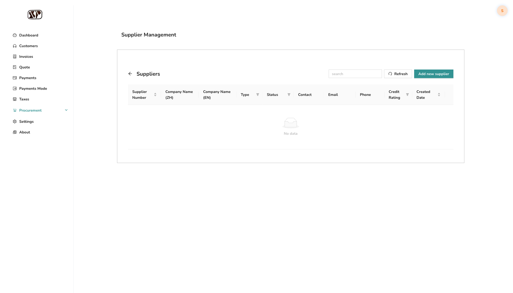

3. Fill in required fields:
   - **Company Name (ZH)**: Enter Chinese company name
   - **Company Name (EN)**: Enter English company name
   - **Type**: Select supplier type (e.g., Manufacturer, Distributor)
   - **Email**: Enter contact email
   - **Phone**: Enter contact phone number
   - 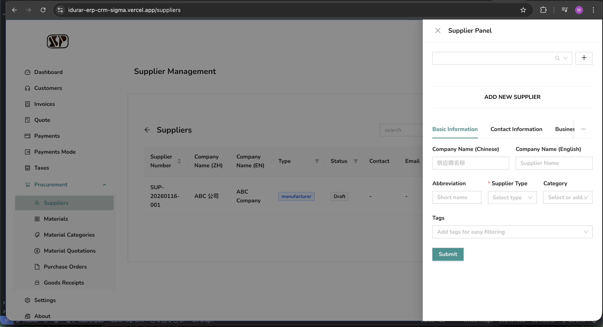

4. Click **"Submit"** button
   - 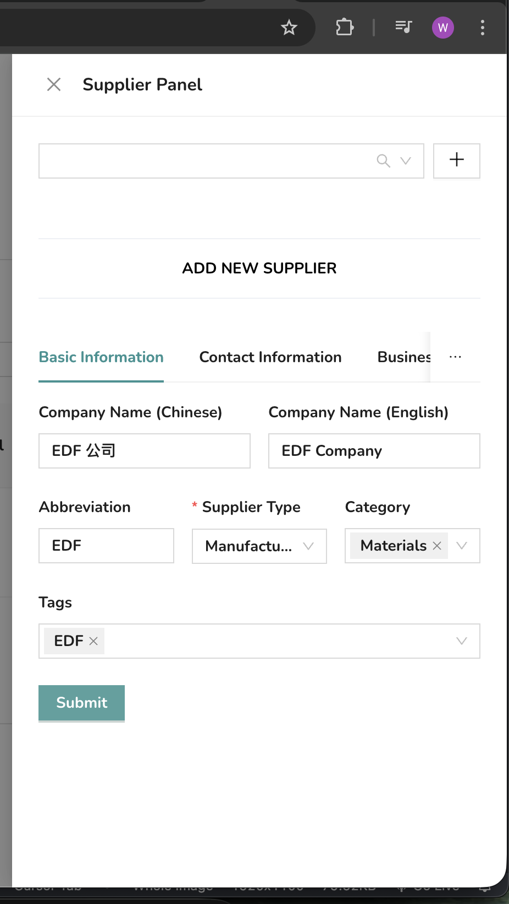

5. Verify success message appears
   - 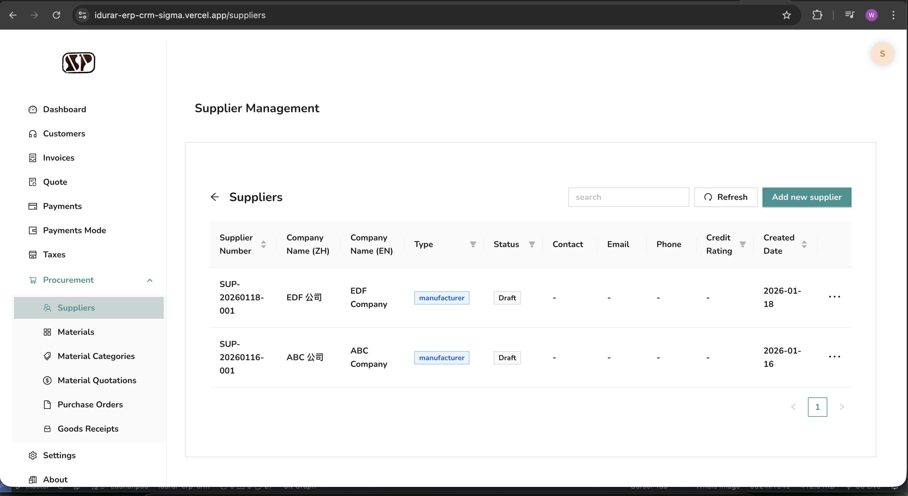

**Expected Result**: Supplier is created successfully and appears in the supplier list

---

#### Use Case 1.2: Upload Supplier Attachments

**Objective**: Attach files to supplier records

**Steps**:

1. Navigate to **Suppliers** page
2. Click on an existing supplier or create a new one
3. Locate the **Attachment** or **File Upload** section
   - 
4. Click **"Upload"** or drag and drop files
5. Select files from your computer
6. Verify files are uploaded and displayed
   - 

**Expected Result**: Files are attached and visible in the supplier record

---

#### Use Case 1.3: Export Supplier List to Excel

**Objective**: Export supplier data to Excel format

**Steps**:

1. Navigate to **Suppliers** page
2. Apply any filters if needed (optional)
3. Click **"Export"** or **"导出"** button
   - 
4. Wait for download to complete
5. Open the downloaded Excel file
   - 

**Expected Result**: Excel file is downloaded with all supplier data in the correct format

---

#### Use Case 1.4: Submit Supplier for Workflow Approval

**Objective**: Submit supplier record for approval workflow

**Steps**:

1. Create or edit a supplier record
2. Fill in all required information
3. Click **"Save"**
4. After saving, click **"Submit"** or **"提交"** button
   - 
5. Confirm submission
6. Verify submission success message
   - 

**Expected Result**: Supplier is submitted for approval and appears in approval queue

---

### 2. Material Management (物料管理)

#### Use Case 2.1: Create Material with Standardized Fields

**Objective**: Create a new material with all required standardized fields

**Steps**:

1. Navigate to **Materials** from the main menu
   - 

2. Click **"新增物料"** (New Material) or **"Create"** button
   - 

3. Fill in required fields:
   - **Material Code**: Enter unique material code (e.g., MAT-001)
   - **Material Name (ZH)**: Enter Chinese material name
   - **Material Name (EN)**: Enter English material name
   - **Unit of Measure**: Select UOM (e.g., EA, KG, M)
   - 

4. Click **"Save"** button
5. Verify success message
   - 

**Expected Result**: Material is created with standardized fields and appears in material list

---

#### Use Case 2.2: Manage Material Categories

**Objective**: Create and manage material categories

**Steps**:

1. Navigate to **Material Categories** page
   - 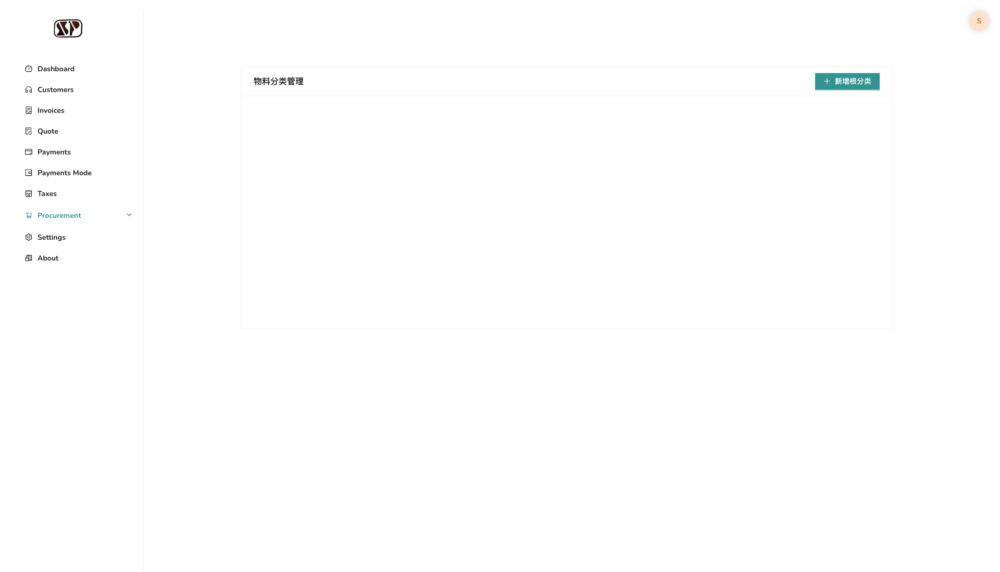

2. Click **"Create"** button
3. Fill in category information:
   - **Category Code**: Enter category code (e.g., CAT-001)
   - **Category Name (ZH)**: Enter Chinese category name
   - **Category Name (EN)**: Enter English category name
   - 

4. Click **"Save"**
5. Verify category is created
   - 

**Expected Result**: Material category is created and can be assigned to materials

---

#### Use Case 2.3: Export Material List to Excel

**Objective**: Export material data to Excel

**Steps**:

1. Navigate to **Materials** page
2. Apply filters if needed
3. Click **"Export"** or **"导出Excel"** button
   - 
4. Wait for download
5. Verify Excel file contains all material data
   - 

**Expected Result**: Excel file downloaded with complete material information

---

### 3. Quotation Management (报价管理)

#### Use Case 3.1: Create Material Quotation with Supplier Comparison

**Objective**: Create a quotation request and compare multiple supplier quotes

**Steps**:

1. Navigate to **Material Quotations** page
   - 

2. Click **"New Quotation"** or **"Create"** button
   - 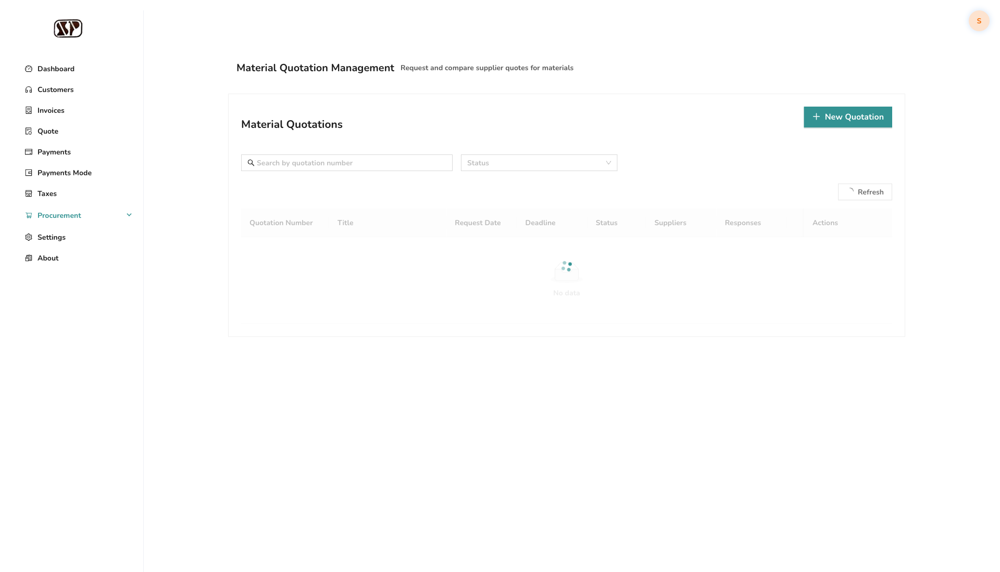

3. Fill in quotation details:
   - **Material**: Select material from dropdown
   - **Quantity**: Enter required quantity
   - 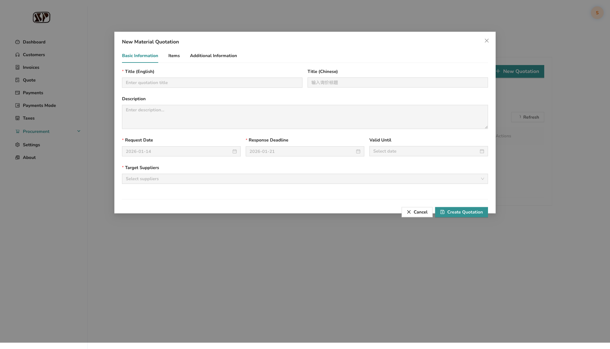

4. Add supplier quotes:
   - Click **"Add Quote"** button
   - Select **Supplier** from dropdown
   - Enter **Unit Price**
   - Repeat for multiple suppliers
   - 

5. Click **"Save"**
6. Verify quotation is created
   - 

**Expected Result**: Quotation created with multiple supplier quotes for comparison

---

#### Use Case 3.2: Upload Quotation Attachments

**Objective**: Attach files to material quotations

**Steps**:

1. Create or open a material quotation
2. Locate **Attachment** section
3. Click **"Upload"** button
   - 
4. Select files to upload
5. Verify files are attached
   - 

**Expected Result**: Files are attached to quotation and accessible

---

#### Use Case 3.3: Submit Quotation for Approval

**Objective**: Submit quotation through approval workflow

**Steps**:

1. Navigate to **Material Quotations** page
2. Select an existing quotation
3. Click **"Submit"** or **"提交"** button
   - 
4. Confirm submission
5. Verify submission success
   - 

**Expected Result**: Quotation is submitted and appears in approval queue

---

#### Use Case 3.4: Compare Multiple Supplier Quotes

**Objective**: View and compare quotes from different suppliers

**Steps**:

1. Navigate to **Material Quotations** page
2. Select a quotation with multiple quotes
3. Click **"Compare"** or **"比较"** button
   - 
4. Review comparison table showing:
   - Supplier names
   - Unit prices
   - Total prices
   - Lead times
   - MOQ/MPQ
   - Valid until dates
   - 

**Expected Result**: Side-by-side comparison of all supplier quotes is displayed

---

## Procurement Execution (采购中：需求MRP与订单执行)

**Goal**: Automated, traceable management from requirements to orders

### 4. MRP Requirements (MRP需求)

#### Use Case 4.1: Calculate MRP Automatically

**Objective**: Run MRP calculation to determine material requirements

**Steps**:

1. Navigate to **MRP** or **Material Requirements** page
   - 

2. Click **"Calculate"**, **"计算"**, or **"Run MRP"** button
   - 

3. Wait for calculation to complete
4. Review calculation results
   - 

**Expected Result**: MRP calculation completes and displays material requirements

---

#### Use Case 4.2: View MRP Requirements with Traceability

**Objective**: View MRP list with traceability information

**Steps**:

1. Navigate to **MRP** page
2. View MRP list table showing:
   - Material information
   - Current inventory
   - In-transit quantities
   - Safety stock
   - Gross requirement
   - Net requirement
   - Suggested order quantity
   - Suggested order date
   - Source/Demand information (traceability)
   - 

**Expected Result**: MRP list displays with all traceability fields visible

---

#### Use Case 4.3: Export MRP List to Excel

**Objective**: Export MRP requirements to Excel

**Steps**:

1. Navigate to **MRP** page
2. Apply filters if needed
3. Click **"Export"** or **"导出"** button
   - 
4. Wait for download
5. Verify Excel file
   - 

**Expected Result**: Excel file downloaded with MRP data

---

#### Use Case 4.4: Generate Purchase Order from MRP Suggestions

**Objective**: Create purchase order directly from MRP suggestions

**Steps**:

1. Navigate to **MRP** page
2. Select one or more MRP lines
   - 
3. Click **"Generate PO"** or **"生成采购订单"** button
   - 
4. Review pre-populated PO form
   - 
5. Modify if needed
6. Click **"Save"**

**Expected Result**: Purchase order is created with data from MRP suggestions

---

### 5. Purchase Order Execution (采购订单执行)

#### Use Case 5.1: Create Purchase Order from Quotation

**Objective**: Create purchase order based on approved quotation

**Steps**:

1. Navigate to **Purchase Orders** page
   - 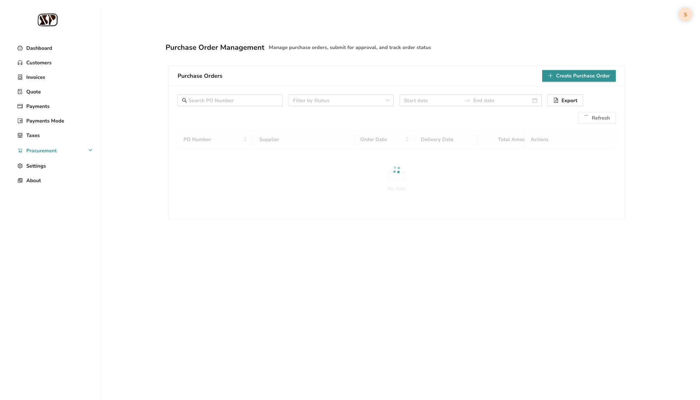

2. Click **"Create Purchase Order"** or **"Create"** button
   - 

3. Fill in PO details:
   - **Supplier**: Select supplier (pre-filled if from quotation)
   - Click **"Add Item"** button
   - **Material**: Select material
   - **Quantity**: Enter quantity
   - **Unit Price**: Enter price (from quotation)
   - 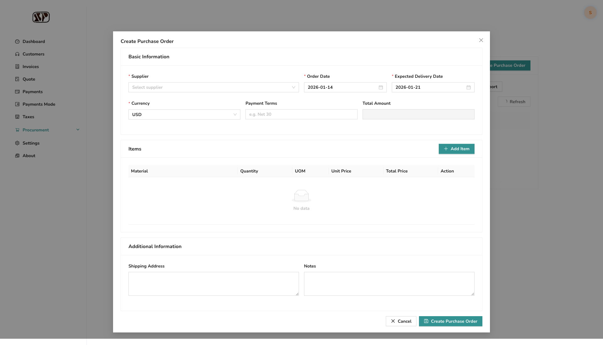

4. Click **"Save"**
5. Verify PO is created
   - 

**Expected Result**: Purchase order created with quotation data

---

#### Use Case 5.2: Upload Purchase Order Attachments

**Objective**: Attach files to purchase orders

**Steps**:

1. Create or open a purchase order
2. Locate **Attachment** section
3. Click **"Upload"** button
   - 
4. Select files
5. Verify files are attached
   - 

**Expected Result**: Files attached to purchase order

---

#### Use Case 5.3: Submit Purchase Order for Approval

**Objective**: Submit PO through approval workflow

**Steps**:

1. Navigate to **Purchase Orders** page
2. Select a purchase order
3. Click **"Submit"** or **"提交"** button
   - 
4. Confirm submission
5. Verify submission success
   - 

**Expected Result**: PO submitted and appears in approval queue

---

#### Use Case 5.4: Track Purchase Order Status

**Objective**: Monitor PO status throughout lifecycle

**Steps**:

1. Navigate to **Purchase Orders** page
2. View status column in PO list
   - 
3. Click on a PO to view details
4. Review status history/workflow status
   - 

**Expected Result**: PO status is visible and trackable throughout lifecycle

---

#### Use Case 5.5: Export Purchase Order List to Excel

**Objective**: Export PO data to Excel

**Steps**:

1. Navigate to **Purchase Orders** page
2. Apply filters if needed
3. Click **"Export"** or **"导出"** button
   - 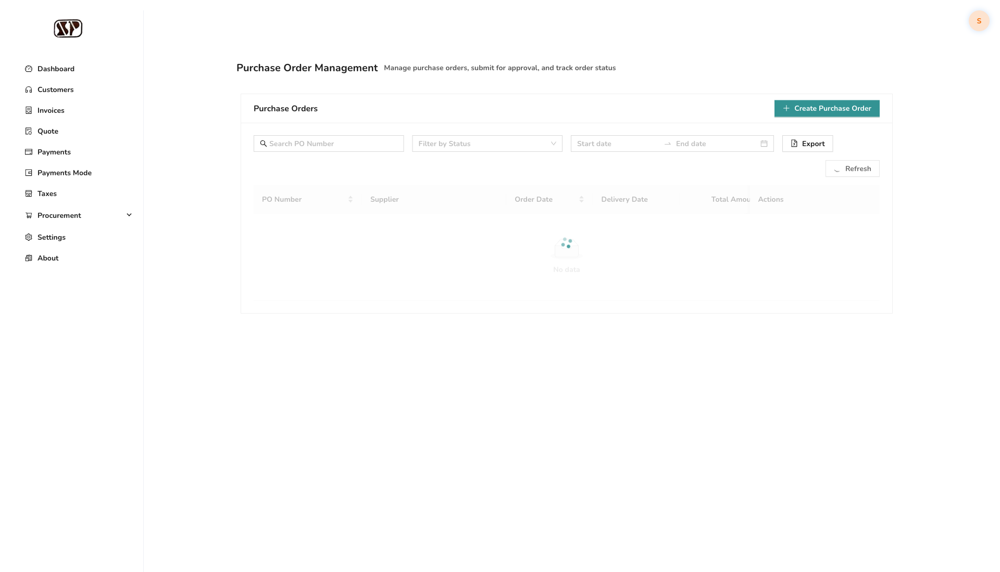
4. Wait for download
5. Verify Excel file
   - 

**Expected Result**: Excel file with all PO data downloaded

---

### 6. Goods Receipt (收货管理)

#### Use Case 6.1: Create Goods Receipt from Purchase Order

**Objective**: Record goods receipt against purchase order

**Steps**:

1. Navigate to **Goods Receipts** page
   - 

2. Click **"New Receipt"** or **"Create"** button
   - 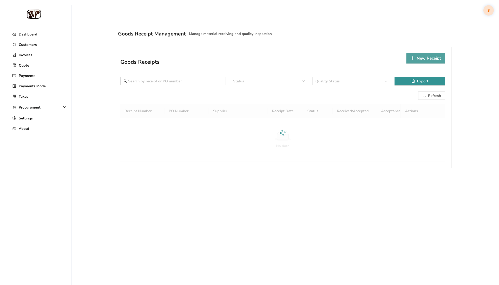

3. Fill in receipt details:
   - **Purchase Order**: Select PO from dropdown
   - **Quantity**: Enter received quantity
   - 

4. Click **"Save"**
5. Verify receipt is created
   - 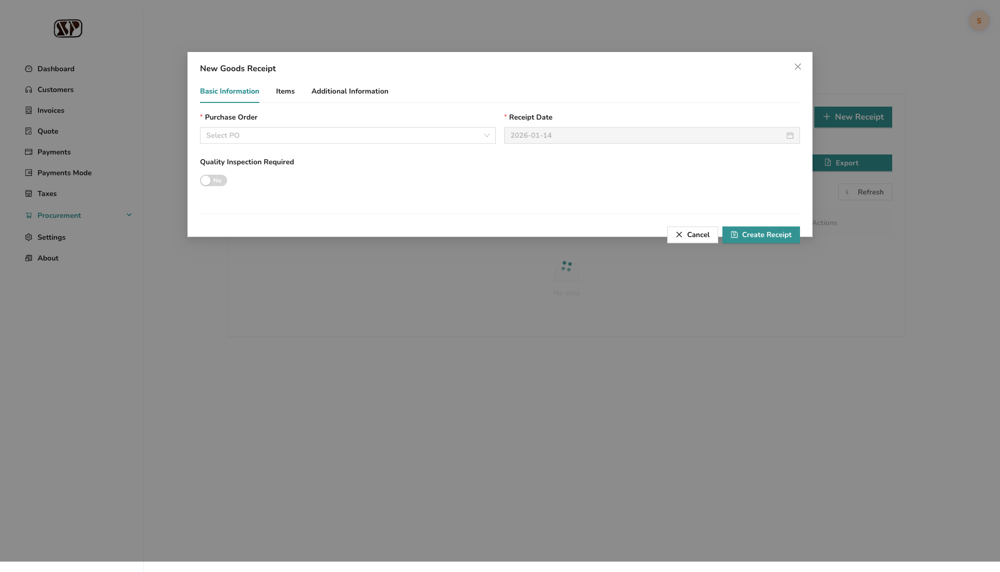

**Expected Result**: Goods receipt created and linked to PO

---

#### Use Case 6.2: Track Goods Receipt Status

**Objective**: Monitor goods receipt status

**Steps**:

1. Navigate to **Goods Receipts** page
2. View status column
   - 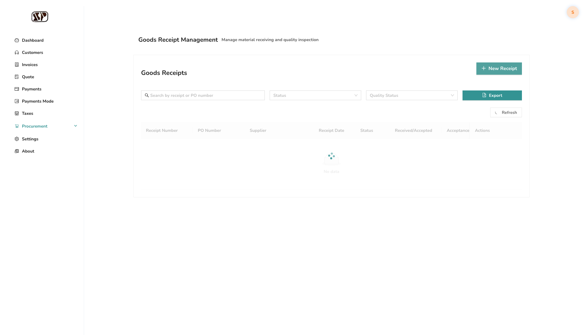
3. Click on receipt to view details
4. Review status information

**Expected Result**: Goods receipt status is visible and trackable

---

## Post-Procurement Management (采购后管理：付款与闭环)

**Goal**: Payment and closure management

### 7. Pre-payment Management (预付款管理)

#### Use Case 7.1: Create Pre-payment Application

**Objective**: Create pre-payment request for approved purchase order

**Steps**:

1. Navigate to **Payment** or **Pre-payment** page
   - 

2. Click **"Create"** button
   - 

3. Fill in payment details:
   - **Purchase Order**: Select approved PO
   - **Payment Amount**: Enter amount
   - **Payment Reason**: Enter reason for pre-payment
   - 

4. Click **"Save"**
5. Verify payment application is created
   - 

**Expected Result**: Pre-payment application created

---

#### Use Case 7.2: Submit Pre-payment for Approval

**Objective**: Submit pre-payment through approval workflow

**Steps**:

1. Navigate to **Payment** page
2. Select a pre-payment application
3. Click **"Submit"** or **"提交"** button
   - 
4. Verify submission success
   - 

**Expected Result**: Pre-payment submitted for approval

---

#### Use Case 7.3: Track Pre-payment Approval Status

**Objective**: Monitor pre-payment approval status

**Steps**:

1. Navigate to **Payment** page
2. View status column showing approval status
   - 
3. Click on payment to view details
4. Review approval workflow status

**Expected Result**: Pre-payment approval status is visible

---

### 8. Payment Closure (付款闭环)

#### Use Case 8.1: Complete Payment Process

**Objective**: Complete approved payment

**Steps**:

1. Navigate to **Payment** page
2. Select an approved payment
3. Click **"Complete"**, **"完成"**, or **"Pay"** button
   - 
4. Confirm completion
5. Verify payment is completed
   - 

**Expected Result**: Payment is completed and marked as paid

---

#### Use Case 8.2: Link Payment to Purchase Order

**Objective**: View payment information linked to purchase order

**Steps**:

1. Navigate to **Purchase Orders** page
2. Select a purchase order
3. View payment information section showing:
   - Pre-payment status
   - Payment history
   - Remaining balance
   - 

**Expected Result**: Payment information is visible and linked to PO

---

## System Requirements

### 9. Full Process Online (全流程线上化)

#### Use Case 9.1: Supplier Onboarding Workflow

**Objective**: Complete supplier onboarding through online workflow

**Steps**:

1. Create supplier record
2. Fill in all required information
3. Upload required documents
4. Submit for approval
5. Track approval status
6. Receive approval notification
   - 

**Expected Result**: Supplier onboarding completed entirely online

---

#### Use Case 9.2: Quotation Approval Workflow

**Objective**: Process quotation through online approval

**Steps**:

1. Create material quotation
2. Add supplier quotes
3. Submit for approval
4. Approvers review and approve/reject
5. Notification sent to requester
   - 

**Expected Result**: Quotation processed through online approval workflow

---

#### Use Case 9.3: Order Approval Workflow

**Objective**: Process purchase order through online approval

**Steps**:

1. Create purchase order
2. Submit for approval
3. Approvers review based on amount/rules
4. Approval/rejection decision
5. Notification sent
   - 

**Expected Result**: Purchase order processed through online approval

---

#### Use Case 9.4: Payment Application Workflow

**Objective**: Process payment application through online workflow

**Steps**:

1. Create pre-payment application
2. Link to approved PO
3. Submit for approval
4. Finance reviews and approves
5. Payment processed
   - 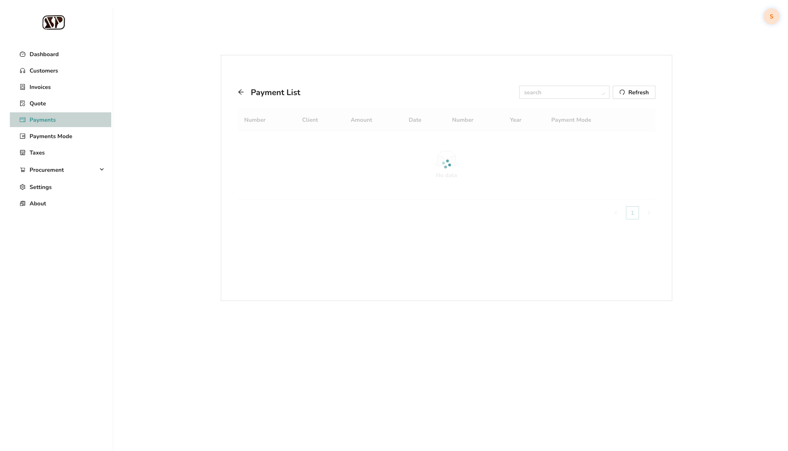

**Expected Result**: Payment processed entirely online

---

### 10. Approval Workflow Engine (审批流程引擎)

#### Use Case 10.1: Configure Multi-level Approval Workflow

**Objective**: Set up multi-level approval workflow

**Steps**:

1. Navigate to **Workflows** page
   - 

2. Click **"Create"** button
   - 

3. Fill in workflow details:
   - **Name**: Enter workflow name
   - **Document Type**: Select (e.g., Purchase Order)
   - 

4. Add approval levels:
   - Click **"Add Level"** button
   - Select **Approver** (e.g., Procurement Manager)
   - Add another level
   - Select **Approver** (e.g., General Manager)
   - 

5. Click **"Save"**
6. Verify workflow is created
   - 

**Expected Result**: Multi-level approval workflow configured

---

#### Use Case 10.2: Configure Amount-based Approval Routing

**Objective**: Set up approval routing based on amount ranges

**Steps**:

1. Navigate to **Workflows** page
2. Click **"Create"** button
3. Fill in workflow name and document type
4. Configure amount-based rules:
   - **Min Amount**: 0
   - **Max Amount**: 10,000
   - **Approver**: Procurement Manager
   - Click **"Add Rule"**
   - **Min Amount**: 10,000
   - **Max Amount**: 100,000
   - **Approver**: General Manager
   - 

5. Click **"Save"**
6. Verify workflow is created

**Expected Result**: Amount-based approval routing configured

---

#### Use Case 10.3: View Approval Workflow Status

**Objective**: Monitor approval workflow status

**Steps**:

1. Navigate to **Approvals** or **Approval Dashboard** page
   - 

2. View approval queue showing:
   - Pending approvals
   - Approved items
   - Rejected items
   - Status indicators
   - 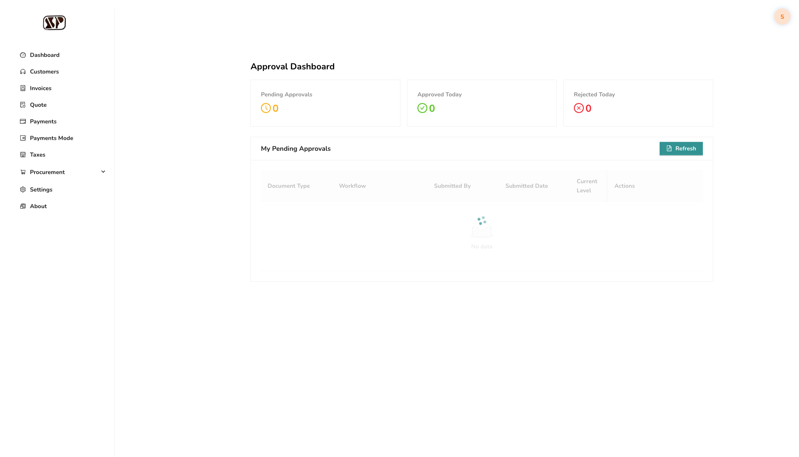

**Expected Result**: Approval workflow status is visible and trackable

---

### 11. Attachment Management (附件管理)

#### Use Case 11.1: Supplier File Attachments

**Objective**: Upload and manage supplier attachments

**Steps**:

1. Navigate to **Suppliers** page
2. Open supplier record
3. Locate **Attachments** section
4. Upload files (contracts, certificates, etc.)
   - 
5. View, download, or delete attachments

**Expected Result**: Supplier attachments are managed effectively

---

#### Use Case 11.2: Material Quotation Attachments

**Objective**: Attach files to material quotations

**Steps**:

1. Create or open material quotation
2. Locate **Attachments** section
3. Upload quotation-related files
   - 
4. Manage attachments

**Expected Result**: Quotation attachments are stored and accessible

---

#### Use Case 11.3: Purchase Order Attachments

**Objective**: Attach files to purchase orders

**Steps**:

1. Create or open purchase order
2. Locate **Attachments** section
3. Upload PO-related files (contracts, specifications, etc.)
   - 
4. Manage attachments

**Expected Result**: PO attachments are managed throughout lifecycle

---

### 12. Data Exportability (数据可导出性)

#### Use Case 12.1: Export Supplier List to Excel

**Objective**: Export supplier data to Excel format

**Steps**:

1. Navigate to **Suppliers** page
2. Apply filters if needed
3. Click **"Export"** or **"导出"** button
4. Wait for download
5. Open Excel file and verify data
   - 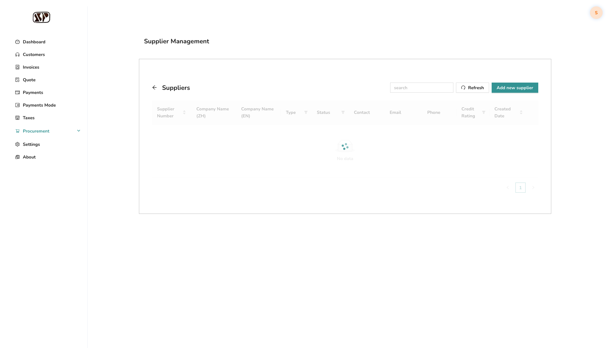

**Expected Result**: Supplier list exported to Excel with all data

---

#### Use Case 12.2: Export Material List to Excel

**Objective**: Export material data to Excel

**Steps**:

1. Navigate to **Materials** page
2. Apply filters if needed
3. Click **"Export"** or **"导出Excel"** button
4. Verify Excel file
   - 

**Expected Result**: Material list exported to Excel

---

#### Use Case 12.3: Export MRP List to Excel

**Objective**: Export MRP requirements to Excel

**Steps**:

1. Navigate to **MRP** page
2. Apply filters if needed
3. Click **"Export"** button
4. Verify Excel file contains MRP data
   - 

**Expected Result**: MRP list exported to Excel

---

#### Use Case 12.4: Export Purchase Order List to Excel

**Objective**: Export PO data to Excel

**Steps**:

1. Navigate to **Purchase Orders** page
2. Apply filters if needed
3. Click **"Export"** button
4. Verify Excel file
   - 

**Expected Result**: Purchase order list exported to Excel

---

### 13. Field Extensibility (字段扩展性)

#### Use Case 13.1: Custom Fields in Supplier Form

**Objective**: Add custom fields to supplier forms

**Steps**:

1. Navigate to **Suppliers** page
2. Create or edit supplier
3. Look for **"Add Field"** or **"自定义字段"** button
4. Add custom fields (e.g., traceability fields)
   - 
5. Fill in custom field values
6. Save supplier

**Expected Result**: Custom fields are available and functional

---

#### Use Case 13.2: Custom Fields in Material Form

**Objective**: Add custom fields to material forms

**Steps**:

1. Navigate to **Materials** page
2. Create or edit material
3. Look for custom field options
4. Add traceability or other custom fields
   - 
5. Save material

**Expected Result**: Custom fields are available in material forms

---

### 14. Permission Control (权限管控)

#### Use Case 14.1: Role-based Access Control

**Objective**: Verify users can only access permitted modules

**Steps**:

1. Login as different user roles:
   - **Purchaser**: Can access procurement modules
   - **Finance**: Can access payment modules
   - **Manager**: Can access approval modules
   - 

2. Verify each role sees appropriate modules
3. Verify restricted modules are not accessible

**Expected Result**: Users only see and access permitted modules

---

#### Use Case 14.2: Role-based Approval Actions

**Objective**: Verify approval actions are role-restricted

**Steps**:

1. Login as approver role
2. Navigate to **Approvals** page
3. Verify **"Approve"** and **"Reject"** buttons are visible
   - 

4. Login as non-approver role
5. Verify approval buttons are not visible

**Expected Result**: Approval actions are restricted to approver roles

---

#### Use Case 14.3: Role-based Data Viewing

**Objective**: Verify data viewing is filtered by role

**Steps**:

1. Login as different roles
2. Navigate to **Purchase Orders** page
3. Verify data is filtered based on permissions
   - 

**Expected Result**: Users only see data they have permission to view

---

#### Use Case 14.4: Role-based Operations

**Objective**: Verify operations are restricted by role

**Steps**:

1. Login as different roles
2. Navigate to various pages
3. Verify **Create**, **Edit**, **Delete** buttons visibility
   - 

**Expected Result**: Operations are restricted based on user role

---

## Appendices

### A. Quick Reference Guide

#### Common Actions

| Action | Location | Button Text |
|--------|----------|-------------|
| Create Supplier | Suppliers → Add new supplier | "Add new supplier" |
| Create Material | Materials → 新增物料 | "新增物料" |
| Create Quotation | Material Quotations → New Quotation | "New Quotation" |
| Create PO | Purchase Orders → Create Purchase Order | "Create Purchase Order" |
| Export Data | Any list page | "Export" or "导出" |
| Submit for Approval | Document detail page | "Submit" or "提交" |

### B. Keyboard Shortcuts

- **Ctrl/Cmd + S**: Save current form
- **Esc**: Close modal/dialog
- **Ctrl/Cmd + F**: Search/Filter

### C. Error Handling

#### Common Issues and Solutions

1. **"Cannot find button"**: 
   - Check if you're on the correct page
   - Try refreshing the page
   - Verify your user role has permissions

2. **"Export not working"**:
   - Check browser download settings
   - Verify data exists to export
   - Try again after a few seconds

3. **"Approval workflow not visible"**:
   - Verify workflow is configured
   - Check user role permissions
   - Contact system administrator

### D. Support Contacts

- **Technical Support**: support@example.com
- **System Administrator**: admin@example.com
- **Training**: training@example.com

### E. Test Users

For testing and demonstration purposes, the following test users have been created with different roles to simulate the procurement workflow:

#### Test User Accounts

| Email | Name | Role | Department | Approval Authority | Password |
|-------|------|------|------------|-------------------|----------|
| `procurement.manager@test.com` | Procurement Manager | Procurement Manager | Procurement | 100,000 CNY | `test123456` |
| `purchaser@test.com` | John Purchaser | Purchaser | Procurement | - | `test123456` |
| `finance.director@test.com` | Finance Director | Finance Director | Finance | 500,000 CNY | `test123456` |
| `finance@test.com` | Finance Personnel | Finance Personnel | Finance | - | `test123456` |
| `general.manager@test.com` | General Manager | General Manager | Executive | 1,000,000 CNY | `test123456` |
| `mrp.planner@test.com` | MRP Planner | MRP Planner | Planning | - | `test123456` |
| `warehouse@test.com` | Warehouse Personnel | Warehouse Personnel | Warehouse | - | `test123456` |
| `data.entry@test.com` | Data Entry | Data Entry Personnel | Procurement | - | `test123456` |

#### User Capabilities

**Procurement Manager** (`procurement.manager@test.com`)
- Can approve Purchase Orders, Suppliers, Material Quotations up to 100,000 CNY
- Full access to procurement processes
- Can manage procurement team

**Purchaser** (`purchaser@test.com`)
- Can create Purchase Orders, Quotations, Suppliers, Materials
- Can submit documents for approval
- Reports to Procurement Manager

**Finance Director** (`finance.director@test.com`)
- Can approve Pre-payments and Purchase Orders up to 500,000 CNY
- Financial oversight authority
- Manages Finance Personnel

**Finance Personnel** (`finance@test.com`)
- Can process payments
- Can view financial data
- Reports to Finance Director

**General Manager** (`general.manager@test.com`)
- Can approve all document types up to 1,000,000 CNY
- Executive approval authority
- Highest approval level

**MRP Planner** (`mrp.planner@test.com`)
- Can run MRP calculations
- Can manage material requirements
- Can generate purchase orders from MRP suggestions

**Warehouse Personnel** (`warehouse@test.com`)
- Can create goods receipts
- Can track inventory
- Can manage warehouse operations

**Data Entry Personnel** (`data.entry@test.com`)
- Can create and update master data (Suppliers, Materials)
- Can maintain data quality
- Limited to data entry operations

#### Organizational Hierarchy

```
General Manager
├── Procurement Manager
│   ├── Purchaser
│   └── Data Entry Personnel
├── Finance Director
│   └── Finance Personnel
├── MRP Planner
└── Warehouse Personnel
```

#### Using Test Users for Workflow Testing

**Pre-Procurement Workflow:**
1. Login as **Purchaser** or **Data Entry Personnel** to create suppliers and materials
2. Submit for approval
3. Login as **Procurement Manager** to approve

**Procurement Workflow:**
1. Login as **Purchaser** to create purchase orders
2. Submit for approval
3. Login as **Procurement Manager** (for amounts < 100K) or **General Manager** (for amounts > 100K) to approve

**Payment Workflow:**
1. Login as **Finance Personnel** to create pre-payment applications
2. Submit for approval
3. Login as **Finance Director** to approve

**MRP Workflow:**
1. Login as **MRP Planner** to run MRP calculations
2. Generate purchase orders from MRP suggestions

**Goods Receipt Workflow:**
1. Login as **Warehouse Personnel** to create goods receipts for received purchase orders

#### Security Note

⚠️ **Important**: All test users share the same password (`test123456`) for testing convenience. **This is for testing purposes only.** In production, each user should have a unique, secure password.

#### Recreating Test Users

To recreate or update test users, run:

```bash
cd backend
node scripts/createTestUsers.js
```

For more details, see `backend/scripts/README-TEST-USERS.md`.

---

### F. Version History

| Version | Date | Changes |
|---------|------|---------|
| 1.0 | 2025-01-XX | Initial release based on 47 acceptance criteria tests |

---

## Document Information

**Document Title**: End-to-End User Manual - Procurement Management System  
**Version**: 1.0  
**Last Updated**: 2025-01-XX  
**Based on**: 47 Acceptance Criteria Tests  
**Author**: System Documentation Team  

**Screenshot Location**: `/doc/screenshots/`  
**Test Coverage**: 100% of acceptance criteria  

### How to Capture Screenshots

To generate screenshots for this manual, see `SCREENSHOT-CAPTURE-GUIDE.md` in the same directory.

**Quick Start:**
```bash
cd frontend
SKIP_WEB_SERVER=true node tests/e2e/00-acceptance-criteria/capture-all-screenshots.js
```

Screenshots will be saved to `doc/screenshots/` directory.

---

*This manual is based on comprehensive end-to-end testing and represents all major workflows in the Procurement Management System.*
